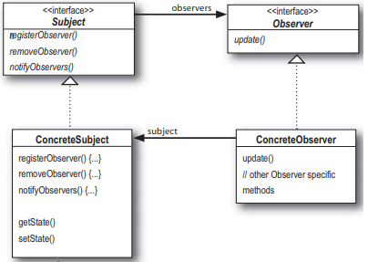

# 2장. Observer Pattern

# 내용 정리

## 옵저버 패턴이란

(상태가 바뀌면 연락을 돌리는 패턴)

한 객체의 상태가 바뀌면 그 객체에 의존하는 다른 객체들에게 연락이 가고 자동으로 내용이 갱신되는 방식으로 일대다(one-to-many) 의존성을 정의한다.

- 주제(subject): 데이터 관리 객체, 데이터가 변경되면 observer에게 연락을 돌린다.
- 구독자(observer): 주제 객체를 구독(등록)되어 있으며, 갱신된 내용을 전달받는다.

실제 구현은 Subject 인터페이스와 Observer 인터페이스를 구현하는 클래스 디자인을 바탕으로 한다.



<aside>
💡 **디자인 원칙**
1. 바뀌는 부분과 바뀌지 않는 부분을 분리한다
   - 바뀌는 부분: Observer 목록
   - 바뀌지 않는 부분: Subject
2. 구현체가 아니라 인터페이스에 맞춰 프로그래밍한다.
   - Observer, Subject 인터페이스 활용함
3. 상속보다는 구성을 활용한다
   - Observer를 ArrayList<Observer>로 구성함
4. 상호작용하는 객체 사이는 느슨하게 결합한다
   - Observer, Subject 인터페이스로 상호작용함

</aside>

# 생각해볼 부분

## 바뀐 값을 알리는 방식에 대해서...

```java
public class WeatherData implements Subject{
	//구독자에게 바뀐 내용을 전달하는 부분에서
	void notifyObservers(){
		//vo 여러번 만드는 일 방지를 위해 미리 만든다. (immutable한 객체임)
		final WeatherDataVO weatherVO = 
				new WeatherDataVO(66.5, 36.5, null); //null이면 바뀐게 없다고 간주
		observers.forEach( observer -> {
			/*
			관측치를 그냥 한까번에 전달하는데 바뀐 property가 하나일수도 있는 것 아닌가?
			그리고 property 자체가 바뀔 때는 Observer의 인터페이스의 수정도 이루어져야 한다.
			*/
			//책에서는 이렇게 하는데
			observer.setMeasurements(80, 65, 30.4f);
			//내 생각에는 이렇게 하는것이 좋을 것 같다.
			observer.setMeasurements(WeatherDataEnum.HUMIDITY, 69.7);
			//혹은 이럴 수도 있을 것 같다. (VO를 넘김)
			observer.setMeasurements(weatherVO);
		});
	}
	//...이하 생략
}
enum WeatherDataEnum{
	TEMPERATURE, HUMIDITY, PRESSURE;
}
```

# 적용 예시

- GUI의 EventListener
- 이벤트 방식의 비동기 서버
- 메시징