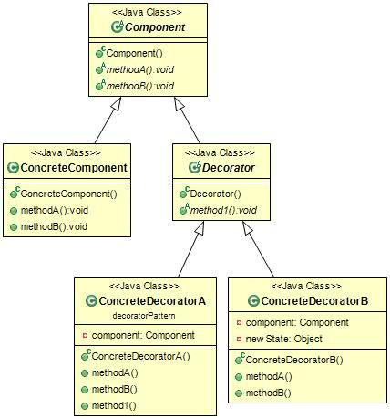

# 3장. Decorator Pattern

# 내용

## 데코레이터 패턴이란

### 기존의 클래스에서 기능을 ‘첨가’하는 형태로 기능을 확장한다.

객체에 추가적인 요건을 동적으로 첨가한다. 데코레이터는 서브클래스를 만드는 것을 통해서 기능을 유연히 확장하는 방법을 제공한다.



1. ```Component```는 직접 쓰일 수도 있고 데코레이터를 wrap하여 쓸 수 있다.
2. ```ConcreteComponent```(구상 구성요소)는 새로운 행동을 동적으로 추가한다
3. ```Decorator```는 자신이 장식할 구성요소와 같은 인터페이스 또는 추상 클래스를 구현하고, 안에는 ```Component``` 객체(의 레퍼런스)가 들어있다.
4. ```ConcreteDecoratorB```(구상 데코레이터)처럼 ```Component의``` 상태를 확장하거나 새로운 메소드를 추가할 수 있다, 그런데 일반적으로는 ```Component```의 원래 있던 메소드를 호출 하기 전, 후에 별도의 작업을 처리하는 메소드로 쓰인다.

## 객체지향 원칙

<aside>
1. 바뀌는 부분은 캡슐화한다
2. 상속보다는 구성을 활용한다
3. extend 대신 implement를 활용한다.
4. class 대신 interface를 통해 객체와 상호작용한다
5. **OCP(Open-Close Principle): 클래스는 변경에 닫혀있고 확장에는 열려있어야한다.**
</aside>

## 이 패턴의 단점

1. **형식 문제**: 특정 형식에 의존하는 클라이언트 코드에 데코레이터를 적용하여 버그의 발생 가능성이 높다.
2. 요소의 초기화가 복잡하다!
    1. 팩토리, 빌더 패턴에서 이를 극복할 방안이 있다.

# 적용

## java의 InputStream


```FileInputStream```, ```StringBufferInputStream```... 등은 ```ConcreteComponent```에 속하고

```BufferedInputStream```, ```LineNumberInputStream``` .. 등은 ```ConcreteDecorator```에 속한다.

```ConcreteDecorator```의 실제 클래스명은 FilterInputStream이다.

## 내 생각
- 기능의 첨가가 얼만큼 이루어질 지 예측할 수 없을때, 즉 인스턴스 변수만으로는 해결이 어려워보이는 상황일 때 쓰는 것이 좋을 것 같다.