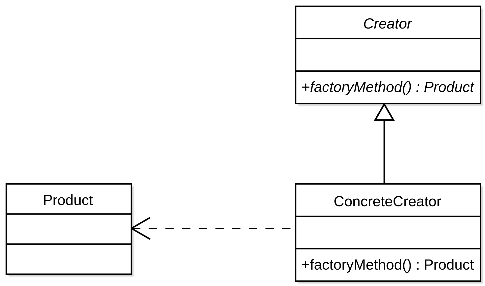
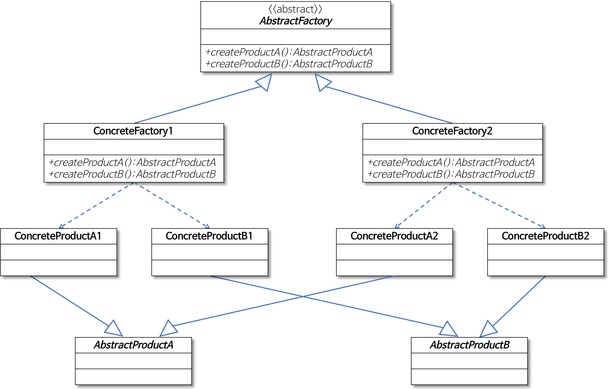

# Ch4. 팩토리 패턴

## 팩토리 메소드 패턴이란

- 인스턴스를 생성하는 코드를 캡슐화한 패턴이다
- 이때 팩토리는 객체를 생성하기 위한 인터페이스이다
- 어떤 클래스의 인스턴스를 만들 지는 팩토리의 서브 클래스에서 결정하게 한다. 

### Creator 클래스
- 추상 Creator 클래스
    - 팩토리 메소드(추상)를 정의한 클래스이다.
    - Creator는 모두 이 추상 클래스를 상속받는다.
    - 서브 클래스로 어떤 구상 클래스가 나올 지는 모른다, 그러나 최소한 Product 클래스를 구현한 클래스라는 것은 확실히 알 수 있다.
### Product 클래스
- 모든 구상 Product 클래스는 추상 Product 클래스를 상속 받아야 한다

## 디자인 원칙
1. 바뀌는 부분은 캡슐화한다.
2. 상속보다는 구성을 활용한다.
3. extend 대신 implement를 사용한다.
3. class 대신 interface를 통해 객체의 상호작용을 한다
4. **OCP**: 클래스는 변경에는 닫혀 있고 확장에는 열려있어야 한다 
5. **DIP**: 고수준의 구성요소는 저수준의 구성요소에 의존해서는 안된다.
    - 고수준 구성요소는 저수준의 구성요소에 의해 정의되는 행동이 들어있다
    - 따라서 고수준 → 저수준의 의존 관계가 발생한다.
    - 이를 추상 클래스, 인터페이스를 통해 고수준 ← 저수준으로 뒤집는 것이 Dpendency-Inversion-Principle이다.

## DIP 가이드라인
지금 쓰려는 클래스가 변할 가능성이 높다면 이 원칙을 지키자.
1. 변수를 선언할 때 Type을 반드시 Interface로 한다.
2. 구상 클래스를 상속하여 클래스를 만들지 말자.
3. 베이스 클래스에서 이미 구현되어있던 메소드를 오버라이드하지 말자.

### Q. 만약 한 클래스에서 객체 생성을 전부 전담한다면?
#### 상황 가정
1. 세상의 모든 피자 생산을 담당할 ```SimplePizzaFactory```라는 클래스가 있다.
2. 이 클래스는 ```orderPizza(style, type)```이라는 메소드가 있다.
3. style로는 ```NY```, ```CH```가 있고, type은 ```cheese```, ```veget```, ```pepperoni```, ```bulgogi```가 있다.
4. ```style``` 별로, ```type```별로 각기 다른 구상 클래스의 새 인스턴스를 리턴한다.

#### 어떤 문제가 생기는가
1. 너무 많은 구상 클래스에 **직접적으로** 의존한다.
2. 이 구상 클래스들의 구현 변경이 이루어진다면? 이 Simple 클래스의 변경도 이루어져야 할 수 있다
3. 또한 클래스 자체가 바뀌어 버렸을때도 마찬가지다.


## 추상 팩토리 패턴

### 추상 팩토리 패턴이란
- 추상 팩토리 패턴에서는 인터페이스를 이용하여 **서로 연관되거나 의존하는 객체를** 구상 클래스를 지정하지 않고도 생성할 수 있다.
- 팩토리 메소드의 객체는 Product를 상속받아서 객체를 만든 반면, 추상 팩토리 패턴은 구성을 통해 객체를 만든다.
    - 팩토리 메소드의의 `Pizza`는 재료의 타입이 여럿 나뉠 수 있지만 추상의 경우에는 재료가 interface로 지정되어있는것 말하는건가(?)

## 적용
- ```slf4j```에서

``` java 
/*
Logger는 Product interface 역할을
LogFactory는 Creator class 역할을 한다
Logger는 인터페이스기 때문에 LogFactory를 통해서 어떤 구상클래스가 나오는지는 모르고 알 필요도 없다.
*/
Logger logger = LogFactory.getLogger(PizzaFactory.class);

```

- 팩토리 메소드의 경우
    - ```Product```를 구성하는 필수 객체가 거의 없거나, 이 객체들의 클래스를 관리해야할 정도로 많지 않다면


- 추상팩토리의 경우
    - ```Product```를 구성하는 필수 객체들이 여럿 있고, 이 객체들의 클래스를 몇가지 interface로 묶을 수 있다면