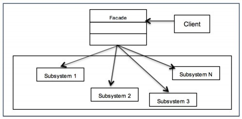

# Ch7. 어댑터와 퍼사드패턴
## 어댑터 패턴이란


### 정의
한 클래스의 인터페이스를 클라이언트에서 사용하고자 하는 다른 인터페이스로 변환하다. 인터페이스 호환성 문제 때문에 같이 서용할 수 없는 클래스를 연결하여 사용할 수 있다.
어댑터는 객체일 수도 있지만 (다중상속이 가능한 언어의 경우) 클래스가 될 수도 있다


## 퍼사드 패턴이란




### 정의
어떤 서브시스템의 일련의 인터페이스에 대한 통합된 인터페이스를 제공한다. 이 서브시스템에 대한 더 고수준의 인터페이스를 정의하여 서브시스템을 쓰기 쉽게 만들어준다.


### 최소 지식 원칙
- 정말 친한 친구하고만 얘기하라
- 어떤 객체든 상호작용하는 클래스의 개수에 주의해야한다.
- 또한 어떤 식으로 상호작용하는지에 대해서도 주의해야 한다.
- 가이드라인: 객체의 메소드는 다음 4 종류만 호출해라
    - 객체 자체
    - 메소드에 매개변수로 전달된 객체
    - 메소드에서 생성하거나 인스턴스를 만든 객체
    - 그 객체에 속하는 구성요소

```java
//Bad
public float getTemp(){
    Thermometer thermometer = station.getThermometer();
    return thermometer.getTemp();
}

//Good
public float getTemp(){
    return station.getTemp();
}
```

## 적용

### 어댑터
- (책에서) `Vector`, `Stack`, `Hashtable`같은 구식 `Collection`은 `Enumeration`만 반환하는데 `Iterator`로 적응시켜 사용할 수 있다.

### 퍼사드
- (100%들어맞지는 않지만) `Keras`와 `Tensorflow`의 관계
    - `Keras`는 `Facade`
    - `Tensorflow`는 `Subsystem`