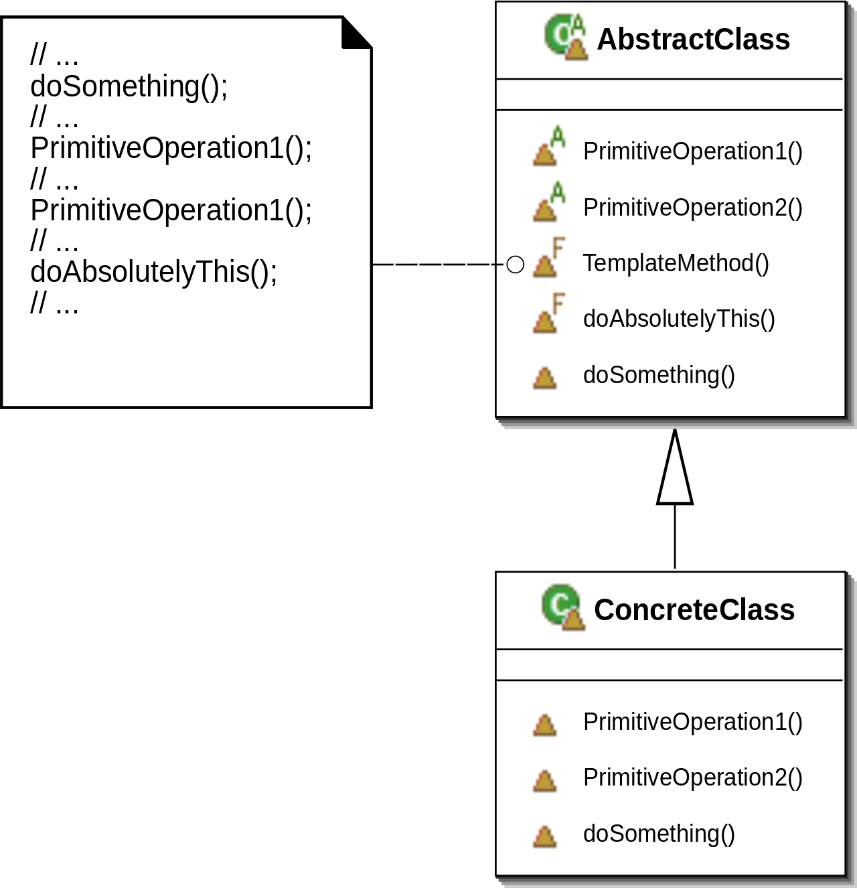

# 8장. Template-Method Pattern

# **템플릿-메소드 패턴 이란**

## **정의 (알고리즘 추상화)**

- 메소드에서 알고리즘의 골격을 정의한다.
- 알고리즘의 여러단계 중 일부는 서브클래스에서 구현한다.
- 템플릿 메소드 패턴은 알고리즘의 구조는 유지한 채 특정 단계를 재정의 할 수 있다.

## Hook란?

- 오버라이드를 할 수도 있고 그냥 넘어갈 수도 있는 메소드
- 다양한 위치에서 알고리즘에 끼어들 수 있는 메소드이다.

## 헐리우드 원칙

- 먼저 연락하지 마세요, 저희가 연락드리겠습니다
- 의존성 부패: 의존성이 고수준, 저수준 구성요소에 상관없이 복잡하게 뒤얽혀있는 상태
- **언제 어떤식으로 저수준 구성요소를 사용할 지 고수준에서 결정한다**
- Spring의 IoC

## 템플릿-메소드 vs 전략 패턴

|  | 템플릿-메소드 | 전략 |
| --- | --- | --- |
| 목표 | 알고리즘의 개요 정의 | 객체 구현을 통해 알고리즘 구현 선택 |
| 구현 방식 | 상속 | 위임 |
| 의존성 | 큼 | 작음 |
| 코드의 양 | 적음 | 템플릿-메소드보다 많음 |
| 구현 범위 | 알고리즘의 일부분 | 알고리즘 전체  |

# 적용

- (책에서) `javax.swing`
- Spring에서 `JdbcTemplate`
    - try - catch 문은 템플릿 메소드
    - 사용자는 쿼리문을 실행하는 알고리즘을 입맛에 맞게 오버라이드 할 수 있다.